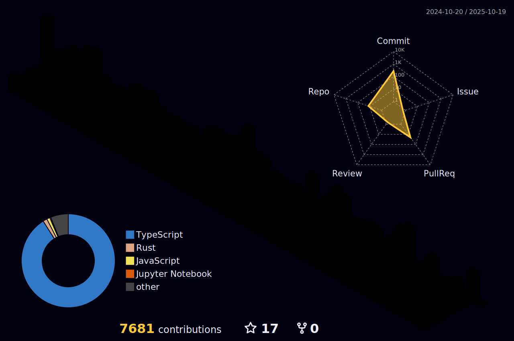

<!--START_SECTION:update_image-->
<!--END_SECTION:update_image-->

<div align="center">

<a href="https://git.io/typing-svg">
  
</a>

<p>
  <samp>
    Building enterprise-scale web & mobile applications across multiple industries.<br>
    TypeScript-first developer who ships from database to UI to infrastructure.
  </samp>
</p>

<p>
  
  
  
  
</p>

</div>


## 🛠️ Tech Stack

<table>
  <tr>
    <td align="center" width="120">
      <br/>
    </td>
    <td>
      
    </td>
  </tr>
  <tr>
    <td align="center">
      
    </td>
    <td>
      
    </td>
  </tr>
  <tr>
    <td align="center">
      
    </td>
    <td>
      
    </td>
  </tr>
  <tr>
    <td align="center">
      
    </td>
    <td>
      
    </td>
  </tr>
  <tr>
    <td align="center">
      
    </td>
    <td>
      
    </td>
  </tr>
  <tr>
    <td align="center">
      
    </td>
    <td>
      
    </td>
  </tr>
  <tr>
    <td align="center">
      
    </td>
    <td>
      
    </td>
  </tr>
</table>

<details>
<summary>📋 Full Tech Stack Details</summary>
<br>

| Category      | Technologies                                                        |
| ------------- | ------------------------------------------------------------------- |
| **Languages** | TypeScript, JavaScript, Rust, Python, SQL/HCL                       |
| **Backend**   | NestJS, Node.js, GraphQL, Apollo Server, Express, Strapi            |
| **Frontend**  | Next.js, React, Vite, Vue 2, Ant Design, Material UI, Framer Motion |
| **Mobile**    | React Native, Expo                                                  |
| **Databases** | MySQL, MSSQL, PostgreSQL, ClickHouse, Redis, Elasticsearch          |
| **ORM**       | TypeORM, Sequelize, Diesel (Rust)                                   |
| **State**     | Redux Toolkit, Zustand                                              |
| **Cloud**     | AWS (S3, Cognito, CloudWatch), Terraform                            |
| **Data**      | Apache Airflow, dbt                                                 |
| **Monorepo**  | Turborepo, pnpm workspaces                                          |
| **Quality**   | ESLint, Prettier, Husky, SonarQube, Sentry                          |

</details>


## 🏢 Domains I Work In

<table>
<tr>
  <td>🏠</td><td><b>Real Estate & Property</b></td><td>Sales platforms, CRM, agency management, smart systems</td>
</tr>
<tr>
  <td>🏥</td><td><b>Healthcare & Insurance</b></td><td>Patient portals, medical records, insurance apps</td>
</tr>
<tr>
  <td>🤝</td><td><b>Homecare Services</b></td><td>Senior care platforms, service scheduling & tracking</td>
</tr>
<tr>
  <td>📦</td><td><b>Logistics & Delivery</b></td><td>Parcel tracking, last-mile delivery integrations</td>
</tr>
<tr>
  <td>📅</td><td><b>Booking & Travel</b></td><td>Online reservation systems</td>
</tr>
<tr>
  <td>🚨</td><td><b>Disaster Response</b></td><td>Damage reporting & contractor coordination</td>
</tr>
<tr>
  <td>💳</td><td><b>Fintech</b></td><td>Payment gateways, billing, bond management</td>
</tr>
</table>


## 🏛️ Architecture Philosophy

```
GraphQL-first APIs  →  Type-safe end-to-end  →  Modular services
     ↓                        ↓                        ↓
Apollo Server         TS strict + codegen        NestJS + Turborepo
     ↓                        ↓                        ↓
 WebSocket              Zero runtime errors        Composable repos
```

- **GraphQL-first** APIs with subscriptions for real-time features
- **Type-safety end-to-end** via TypeScript strict mode + GraphQL Code Generator
- **Modular services** — standalone NestJS APIs, composable with Turborepo monorepos
- **Multi-database** per use case — MySQL, MSSQL, PostgreSQL, ClickHouse for analytics
- **Infrastructure as Code** — AWS provisioned and managed via Terraform


## 📊 GitHub Stats

<div align="center">


</div>

### 📈 Activity Graph


### 🐍 Contribution Snake

<div align="center">
  <picture>
    <source media="(prefers-color-scheme: dark)" srcset="https://raw.githubusercontent.com/rattamnoon/rattamnoon/output/github-contribution-grid-snake-dark.svg" />
    <source media="(prefers-color-scheme: light)" srcset="https://raw.githubusercontent.com/rattamnoon/rattamnoon/output/github-contribution-grid-snake.svg" />
    
  </picture>
</div>

### 🎮 3D Contribution

<div align="center">
  
</div>


## 💬 Quote of the Day

<div align="center">

<!--STARTS_HERE_QUOTE_README-->
<i>❝“I’m not one of those who think Bill Gates is the devil.  I simply suspect that if Microsoft ever met up with the devil, it wouldn’t need an interpreter.”— Nicholas Petreley   ❞</i>
<!--ENDS_HERE_QUOTE_README-->

</div>


## 📫 Get in Touch

<div align="center">

[](https://rattamnoon.com)
[](mailto:rattamnoon.kir@gmail.com)
[](https://www.linkedin.com/in/rattamnoon-kiratipisut-716284187)
[](https://github.com/rattamnoon)

</div>


